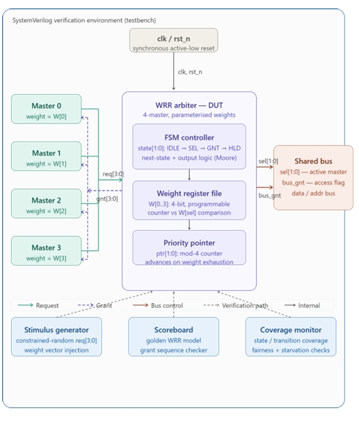
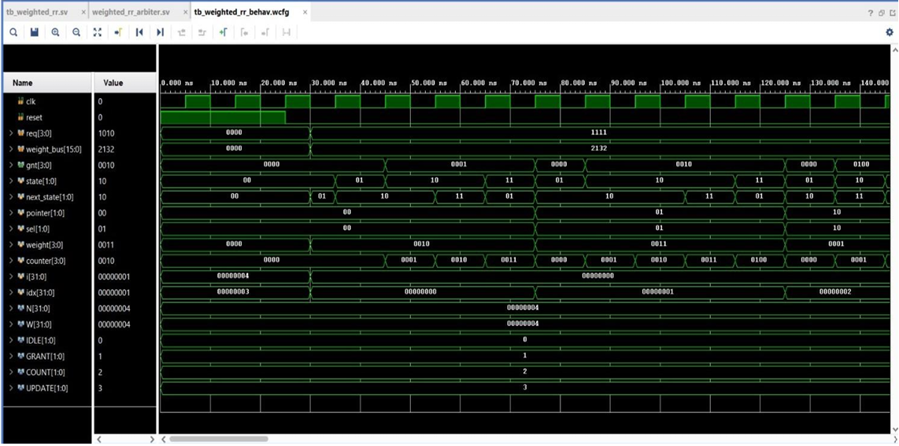

# Interleaved Round-Robin Arbiter (SystemVerilog)

A robust, high-performance 4-requestor Interleaved Round-Robin (IRR) Arbiter implemented in SystemVerilog. The architecture guarantees starvation-free, equitable access among competing hardware requestors by dynamically updating priority indices upon grant generation, while preserving current priority states during idle periods.

---

## Architectural Overview

The arbiter manages resource access across 4 requesting agents using dynamic priority rotation. When a request is granted, the priority register advances to the next sequential requestor index, ensuring fair arbitration round cycles under heavy traffic conditions.

### Key Features

* Starvation-Free Scheduling: Dynamic priority updating guarantees that no single requestor monopolizes shared system resources.
* One-Hot Grant Output: Encodes grant signals into single-bit assertions (`grant[3:0]`), eliminating ambiguity and enabling direct masking logic.
* State Preservation on Idle: Holds current priority state when no requests are active (`request = 4'b0000`), avoiding unneeded priority shifts.
* Self-Checking Testbench: Built-in layered SystemVerilog testbench (`tb_irr_layered.sv`) with structured driver, monitor, and scoreboard routines for complete functional verification.

---

## Block Diagram & System Architecture

The hardware architecture comprises three primary functional blocks:

1. **Priority Register (`priority_reg_sf`)**: Stores the active priority starting index (`priority_out`) and updates to the next index (`g_id + 1`) when active requests are present.
2. **Index Decoders / Priority Logic (`irr_index_logic`)**: Evaluates the incoming 4-bit request vector against the stored priority index to select the highest-priority requestor index (`g_id`).
3. **Top-Level Integration (`irr_arbiter_top`)**: Combines priority tracking, dynamic index calculation, one-hot grant generation, and next-priority routing.



---

## Module Specifications

### Signal Interface (`irr_arbiter_top`)

| Port Name | Direction | Bit Width | Description |
| :--- | :--- | :--- | :--- |
| `clk` | Input | 1 | System clock signal |
| `reset` | Input | 1 | Synchronous/Asynchronous reset (Active High) |
| `request` | Input | [3:0] | 4-bit request vector from client requestors |
| `grant` | Output | [3:0] | 4-bit one-hot grant output vector |
| `g_id` | Output | [1:0] | 2-bit binary index of the awarded requestor |

### Microarchitecture Details

#### 1. Priority Register (`priority_reg_sf`)
- Reset Condition: Sets `priority_out` to `2'b00`.
- Priority Advancement: When `any_r = |request` is asserted, `priority_out` updates to `next_g` (`g_id + 1'b1`).
- Hold Condition: Retains existing `priority_out` when `any_r` is low.

#### 2. Index Logic (`irr_index_logic`)
Decodes request vectors based on the current starting priority:
- Priority `2'd0`: Search order `request[0] -> request[1] -> request[2] -> request[3]`
- Priority `2'd1`: Search order `request[1] -> request[2] -> request[3] -> request[0]`
- Priority `2'd2`: Search order `request[2] -> request[3] -> request[0] -> request[1]`
- Priority `2'd3`: Search order `request[3] -> request[0] -> request[1] -> request[2]`

---

## Verification & Simulation Results

Verification is conducted via a self-checking testbench (`tb_irr_layered.sv`) covering 5 comprehensive test scenarios:

1. **Scenario 1 (Continuous Full Load)**: `request = 4'b1111` for 6 cycles. Verifies round-robin rotation (`0001` -> `0010` -> `0100` -> `1000`).
2. **Scenario 2 (Idle State)**: `request = 4'b0000` for 2 cycles. Confirms `grant = 4'b0000` and priority stability.
3. **Scenario 3 (Partial Sparse Request)**: `request = 4'b1001` for 6 cycles. Verifies back-and-forth arbitration between agent 0 and agent 3 based on priority tracking.
4. **Scenario 4 (Single Request Assertion)**: Individual assertions (`0001`, `0010`, `0100`, `1000`) testing direct grant generation.
5. **Scenario 5 (Alternating Request Patterns)**: Alternating `0101` and `1010` request patterns verifying priority preservation across cycles.

### Simulation Output Screenshot

The simulation output screenshot demonstrates clean test execution with all scoreboard verification checks passing:



---

## Repository File Structure

```
weighted-roundrobin-arbiter/
├── Screenshots/
│   ├── Block_diagram.jpeg    # Microarchitecture block diagram
│   └── Output.png             # Simulation waveform and scoreboard report
├── priority_reg_sf.sv        # RTL SystemVerilog design source file
├── tb_irr_layered.sv         # Layered SystemVerilog verification testbench
├── Report.pdf                # Detailed design documentation report
├── LICENSE                   # Software license definition
└── README.md                 # Project README documentation
```

---

## Simulation & Execution Guide

### Running with Icarus Verilog & GTKWave

To compile and simulate using Icarus Verilog:

```bash
# Compile design and testbench
iverilog -g2012 -o arbiter_sim priority_reg_sf.sv tb_irr_layered.sv

# Run simulation
vvp arbiter_sim
```

### Running with Siemens ModelSim / QuestaSim

```tcl
# Create work library
vlib work

# Compile SystemVerilog sources
vlog -sv priority_reg_sf.sv tb_irr_layered.sv

# Run simulation in command-line mode
vsim -c tb_irr_layered -do "run -all; quit"
```

### Running with Xilinx Vivado Simulator (xsim)

```bash
# Analyze sources
xvlog -sv priority_reg_sf.sv tb_irr_layered.sv

# Elaborate snapshot
xelab tb_irr_layered -s top_sim

# Run simulation
xsim top_sim -R
```

---

## License

This project is licensed under the terms defined in the [LICENSE](LICENSE) file.

---

## Contributors

* M. Madhumitha
* V. Sivani
* P. Yasaswini